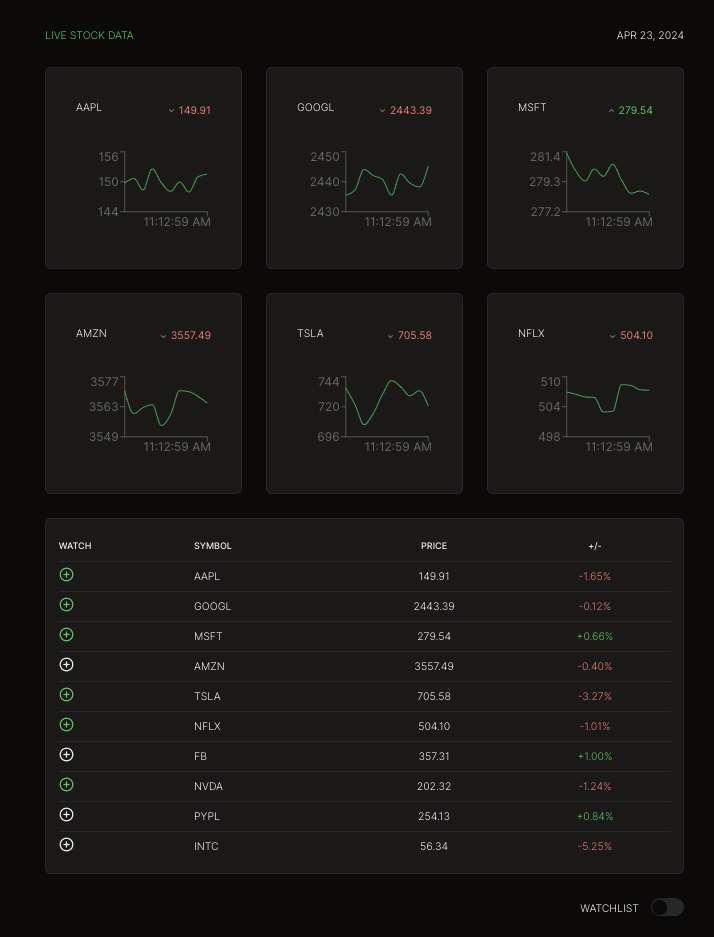

# Stocks Dashboard

This project consists of a Next.js frontend and an Express.js backend. The frontend displays stock data that is updated in real-time via a WebSocket connection to the backend.

## Prerequisites

- Node.js
- npm

## Getting Started

### Backend

1. Navigate to the server directory:

```sh
cd server
```

2. Install dependencies:

```sh
npm install
```

3. Create a `.env` file in the `server` directory with the following content:

```
MYSQL_HOST=*your_mysql_host*
MYSQL_USER=*your_mysql_user*
MYSQL_PASSWORD=*your_mysql_password*
MYSQL_DATABASE=*your_mysql_database*
```

4. Start the server:

```sh
npm run dev
```

The server will start on port 5000.

### Frontend

1. Navigate to the client directory:

```sh
cd client
```

2. Install dependencies:

```sh
npm install
```

3. Start the frontend:

```sh
npm run dev
```

The frontend will start on port 3000.

## Testing

### Backend

1. Navigate to the server directory:

```sh
cd server
```

2. Run tests:

```sh
npm test
```

## Features

- Simulated real-time stock data updates
- Add stocks to a watchlist
- Remove stocks from the watchlist
- Filter stocks by watchlist

## Technologies

### Frontend

- Next.js
- React
- Shadcn/ui
- React Query
- TypeScript
- JavaScript

### Backend

- Express
- MySQL
- WebSocket
- TypeScript
- JavaScript

## Screenshots



## License

Distributed under the MIT License. See `LICENSE` for more information.
